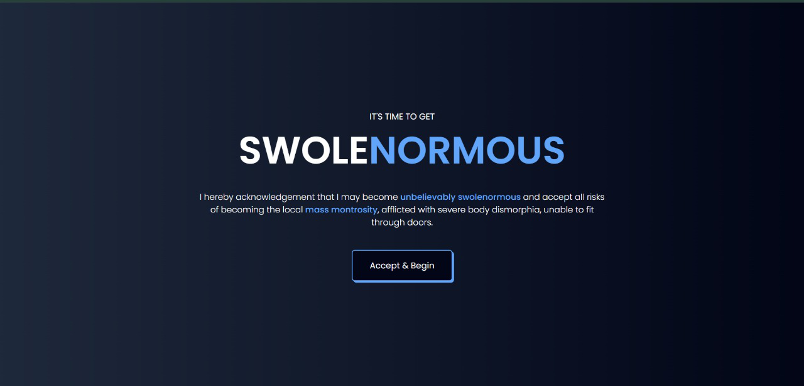
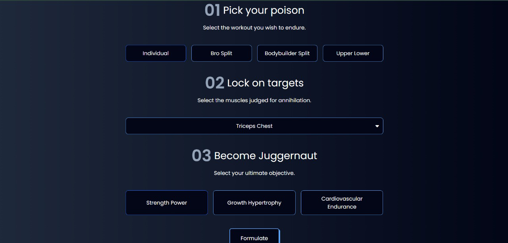
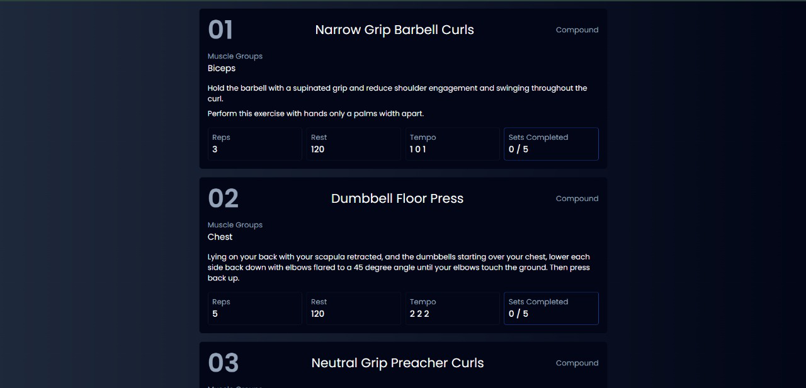

# Fit Sphere

**Fit Sphere** is a React-based frontend fitness tracking web application designed to generate customized workout plans based on user inputs like workout type, target muscle groups, and objectives.

## Table of Contents
- [Features](#features)
- [Technologies Used](#technologies-used)
- [Installation](#installation)
- [Usage](#usage)
- [Screenshots](#screenshots)
- [Contributing](#contributing)
- [License](#license)
- [Contact](#contact)

---

## Features
- **User Input-Based Activity Suggestions**: Get suggested workout activities based on workout type, muscle groups, and objectives.
- **Detailed Workout Instructions**: Each activity includes specific instructions such as tempo, reps, rest time, and sets.
- **Set Tracking**: Track the number of sets completed for each suggested workout.
- **Responsive Design**: Designed for use across desktop, tablet, and mobile devices.

---

## Technologies Used
- **Frontend**: React.js, JavaScript, HTML, CSS
- **State Management**: React State
- **Version Control**: Git

---

## Installation
Follow these steps to set up **Fit Sphere** locally:

1. **Clone the repository**
   ```bash
   git clone https://github.com/iamrohitm/Fit-Sphere.git
   ```

2. **Navigate to the project directory**
   ```bash
   cd Fit-Sphere
   ```

3. **Install dependencies**
   ```bash
   npm install
   ```

4. **Start the app**
   ```bash
   npm start
   ```

5. **Access the app**
   - Open your browser and navigate to `http://localhost:3000`

---

## Usage
1. **Select Workout Type**: Pick from options like `individual`, `bro split`, or `bodybuilder split`.
2. **Choose Target Muscle Groups**: Select muscle groups like `push`, `pull`, or `legs`.
3. **Set Objectives**: Define your goal, such as:
   - **Strength Power**
   - **Growth Hypertrophy**
   - **Cardiovascular Endurance**
4. **Get Workout Activities**: A detailed workout plan is generated based on your inputs, including:
   - Exercise name
   - Muscle group focus
   - Reps, rest, tempo, and instructions
5. **Track Progress**: Update completed sets for each activity.

---

## Screenshots
### Main Page


### Workout Results (Steps)


### Sample Output Result


---

## Contributing
Contributions are welcome! Here's how you can contribute:
1. Fork the repository.
2. Create a new branch.
   ```bash
   git checkout -b feature/your-feature-name
   ```
3. Commit your changes.
   ```bash
   git commit -m "Add your feature"
   ```
4. Push to your branch.
   ```bash
   git push origin feature/your-feature-name
   ```
5. Open a pull request.

---

## License
This project is not currently licensed..

---

## Contact
**Rohit Mohite**
- Email: [rohitmohite.in@gmail.com](mailto:rohitmohite.in@gmail.com)
- LinkedIn: [Rohit Mohite](https://www.linkedin.com/in/rohit-mohite-832792232/)
- GitHub: [iamrohitm](https://github.com/iamrohitm)

---

*Thank you for checking out Fit Sphere! Feel free to star the repository if you find it helpful.*


